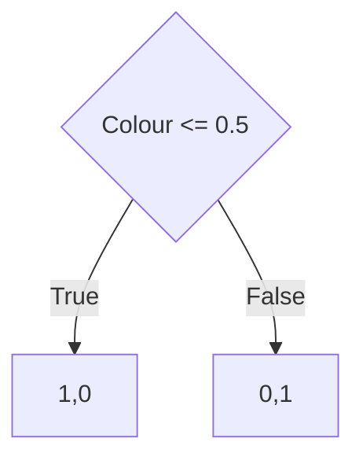
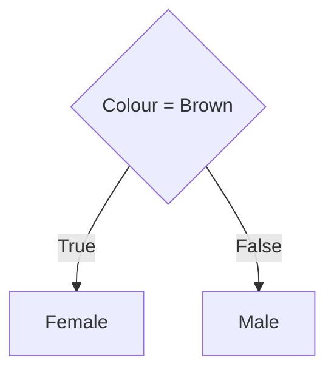

# Decision Classifier

High speed white box decision classifier.

Low code solution


## Usage


We would like to determine the Gender of a Bower Bird by it's colour and size.

### Training

`data/Bower_Birds.csv`
| Colour | Size | Gender |
|--------|------|--------|
| Brown  | M    | Female |
| Black  | M    | Male   |

We now set the "features" as Colour and Size. Then the "result" as Gender

`data/config.yml`
```
data:
  features:
  - Colour
  - Size
  result: Gender
source: data/Bower_Birds.csv
input: data/new.csv
```

We now run `train.py`

Based on this very simple example we get the following decision tree



As the decision classifier exchanges strings for an integer value we can use the mapped.json file to determine the plain text decisions.



### Classification

In the `data/new.csv` we will input our data which needs classification.

`data/new.csv`
| Colour | Size |
|--------|------|
| Black  | M    |

And now run `classifier.py`

Result == Male

This result will also be written do data/result.txt

It is important to note by default classifier.py will continue to wait for the new data to be updated. This allows you to submit csv's with new data for as long as needed. Graceful stopping is yet to be implemented.


### Classification of Untrained data

If we input data options which have not been trained this will raise an error.

| Colour | Size |
|--------|------|
| Black  | L    |

Size L was not included in our original model we will need to add a Size L variant to our source data and retrain the model.

Alternatively as the tree shows we do not use the Size to determine the result we can remove Size from the config features.


## Setup

### Virtual Environment

Unix
```
python3 -m venv env
source env/bin/activate
pip3 install -r requirements.txt
```

### Docker

Set the local data storage location in `docker-compose.yml`

```
    volumes:
      - MY_LOCAL_DIR:/app/data
```

`docker-compose up`

To switch to classification

`docker stop decision && docker rm decision`


Set the entrypoint in `docker-compose.yml`

```
entrypoint: ["python", "classifier.py"]
```

`docker-compose up`